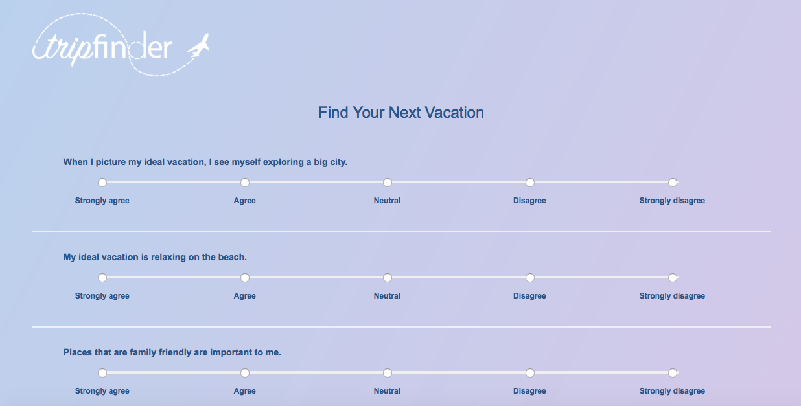
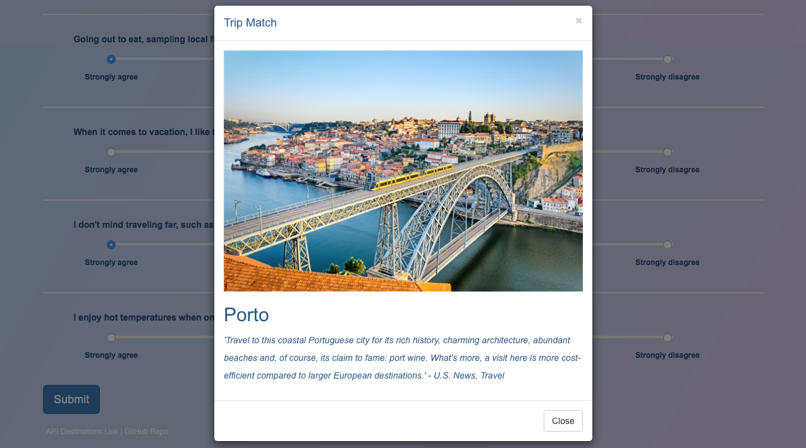

# Trip-Finder

### Overview

Created during Week 7 of Rutgers Coding Bootcamp. The challenge was to use Node JS and Express to create a compatibility-based application. I made it a "Trip Finder" theme in which the application takes in results from a user's survey to find out what the user is looking for in their next vacation. The survey is designed using the likert-scale and allows the user to select choices from Strongly Agree to Strongly Disagree. The app then displays the name, picture and trip description of the destination with the best overall match. I also designed the logo in Adobe Illustrator. 

Express was used to handle routing and Node JS was used to create the backend of this application. The application has been deployed to Heroku.
[Experience Trip Finder.](https://trip-finder-carvalho.herokuapp.com/)

### Illustrations

Home screen:

Survey:

Calculated trip match:

### Different Routes
- `/`
	* Default, catch-all route that leads to home.html

- `/app/public/survey`
	* Leads to the survey.html page

- `/api/trips`
	* Displays all the possible different trip matches or destinations (reads the array of objects in the trips.js file)

- `/api/match`
	* Where the compatability is calculated

### How compatibility is calculated 

1. The user's results is converted into a simple array of numbers.
	* ex: [5, 1, 4, 4, 5, 1, 2, 5, 4, 1, 2, 4]
	* The value of Strongly Agree is 5 and the value of Strongly Disagree is 1. 

2. Then, we compare the difference between the current user's scores against the scores of each trip, question by question and store it in a scoreDiffArray. The data for each trip has been pre-written in the trips.js file.  
	* Note: absolute values of the differences is used: `scoreDiffArray.push(Math.abs(diff))` 

	* Example:

	 	userScore: 		      [5, 1, 4, 4, 5, 1, 2, 5, 4, 1, 2, 4]

	 	currentTripScore: 	  [3, 2, 4, 3, 5, 1, 2, 5, 4, 3, 3, 4]

	 	scoreDiffArray:       [2, 1, 0, 1, 0, 0, 0, 0, 0, 2, 1, 0]

3. We then sum all differences in the scoreDiffArray to calculate the totalDiff of that particular trip. We do this for each trip.
	* ex: The sum of the above scoreDiffArray is 7: `var totalDiff = scoreDiffArray.reduce(getSum);`

4. We then push this value into an array called totalDiffArray.

5. The smallest number in the totalDiffArray is determined: `minNumber = Math.min( ...totalDiffArray );` 

6. The smallest number in the totalDiffArray is our trip match, which has been set to the variable minNumber. We then find the index of minNumber in the totalDiffArray to find the data from the trip. The trip match data is then diplayed as a modal pop-up.

### Tech used
- Node.js
- Express.js

### Built With

* Sublime Text - Text Editor

### Authors

* **Nicole Carvalho** - *Node, Express, Design with Adobe Illustrator* - [Nicole Carvalho](https://github.com/nicolelcarvalho)
